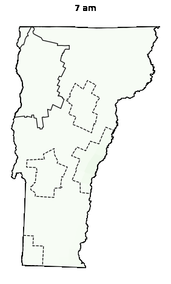

GitHub Repository: [HEGSRR/OR-VT-Pharmacy](https://github.com/HEGSRR/OR-VT-Pharmacy)

# Study Reports

- [Original study report](https://hegsrr.github.io/OR-VT-Pharmacy/report.html) (generated with the `01_Pharmacy_Accessibility.ipynb` notebook)
- [Pre-registered analysis plan](https://hegsrr.github.io/OR-VT-Pharmacy/report/analysis_plan.pdf)
- [Supplementary materials report](https://hegsrr.github.io/OR-VT-Pharmacy/report/supplementary_report.pdf)

## Alternative study versions

Several alternative reports are available for alternative study versions using different study parameters. These are available below for comparison to the original study and check on sensitivity and robustness. 
These reports were generated with the `02_Study_Variations.ipynb` Jupyter notebook.

Additionally, any two sets of study results can be compared with the `03_Compare_Results.ipynb` Jupyter notebook, and selected comparison links are included below.

- [Original study parameters](https://hegsrr.github.io/OR-VT-Pharmacy/report/original_parameters.html)
- [June 2025 updated data](https://hegsrr.github.io/OR-VT-Pharmacy/report/june_2025.html) and [comparison to 2023](https://hegsrr.github.io/OR-VT-Pharmacy/report/compare_2023_2025.html)
- [Technicians as 0.7](https://hegsrr.github.io/OR-VT-Pharmacy/report/technicians_pt7.html)
- [Technicians as 0.3](https://hegsrr.github.io/OR-VT-Pharmacy/report/technicians_pt3.html)
- [Elderly Population](https://hegsrr.github.io/OR-VT-Pharmacy/report/elderly_population.html)
- [Mean distance weight](https://hegsrr.github.io/OR-VT-Pharmacy/report/distweight_mean.html)
- [Additional distance bands](https://hegsrr.github.io/OR-VT-Pharmacy/report/granular_distance.html)
- [Census blocks](https://hegsrr.github.io/OR-VT-Pharmacy/report/census_blocks.html)
- [Additional distance bands and census blocks](https://hegsrr.github.io/OR-VT-Pharmacy/report/granular_distance_census_blocks.html) and [comparison to original study parameters](https://hegsrr.github.io/OR-VT-Pharmacy/report/compare_granularity.html)
- [Simulated staffing data](https://hegsrr.github.io/OR-VT-Pharmacy/report/simulated_staffing.html)

The results linked above are discussed in the supplementary materials of the manuscript.

## Animations

| Weekday | Saturday | Sunday |
| :--: | :--: | :--: | 
|  |  |  |